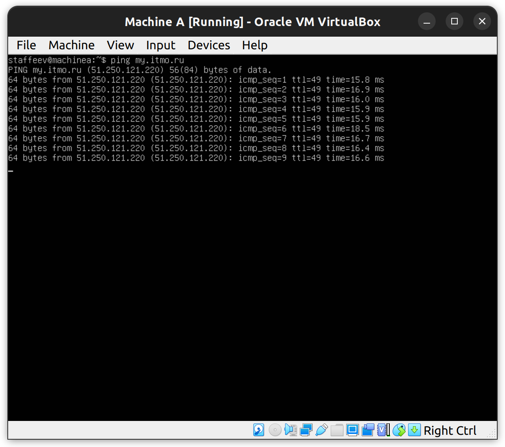
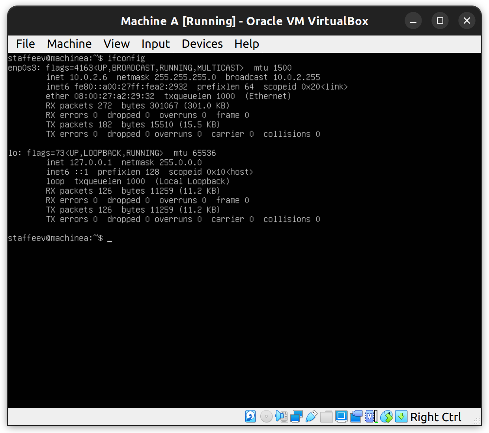
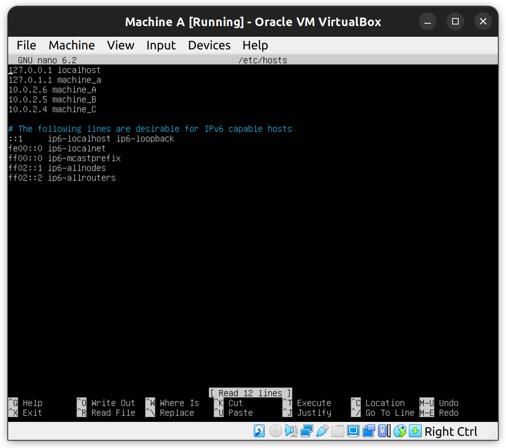
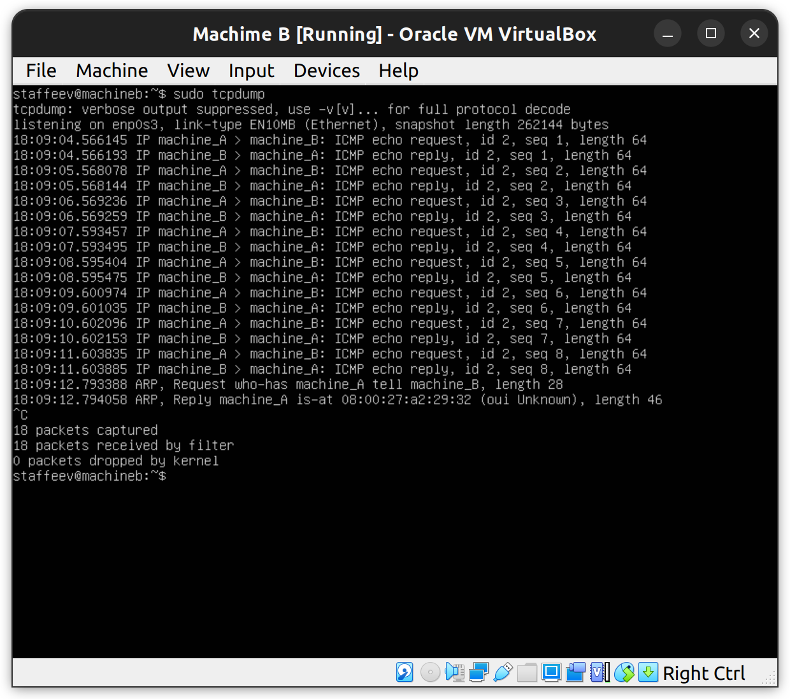
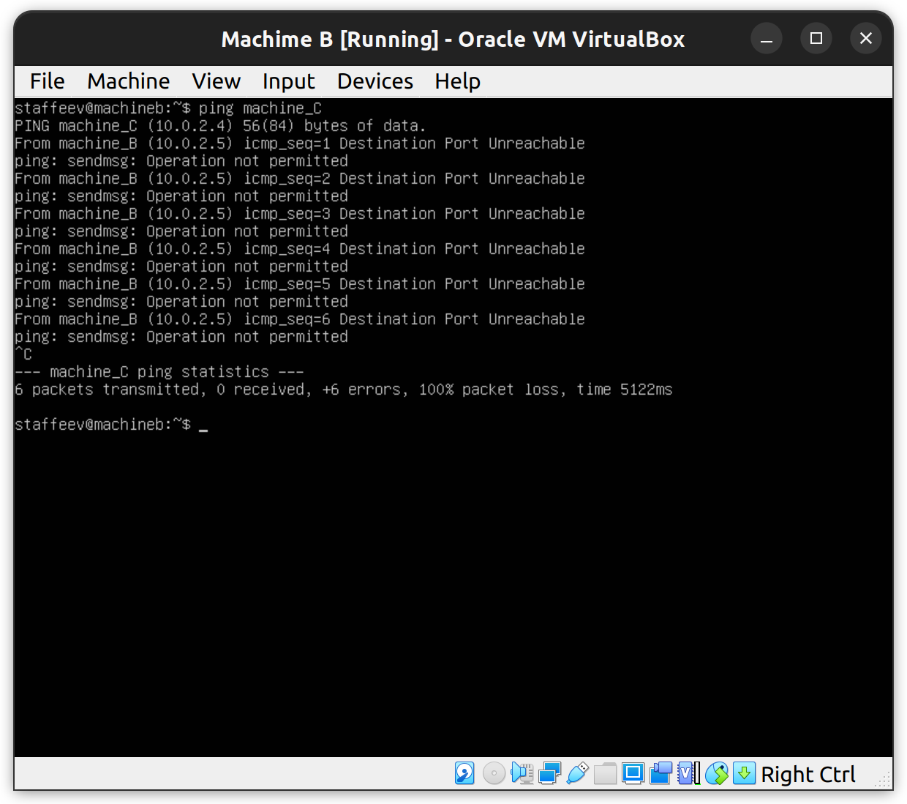
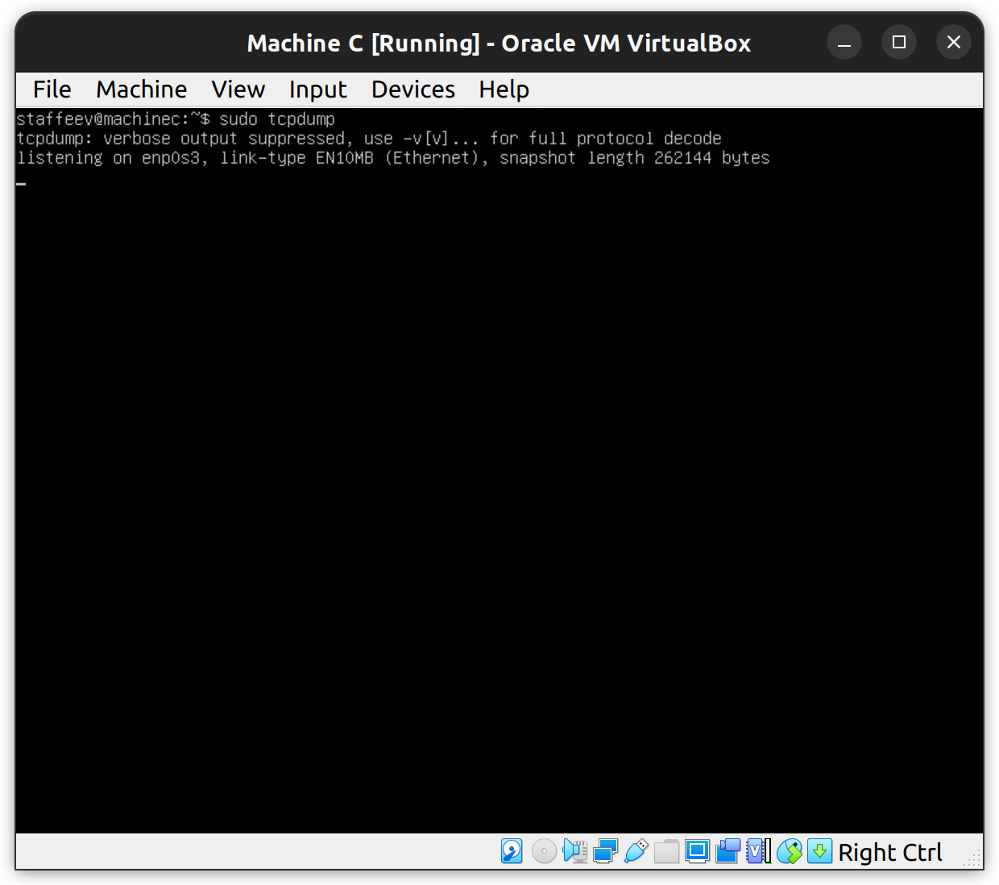
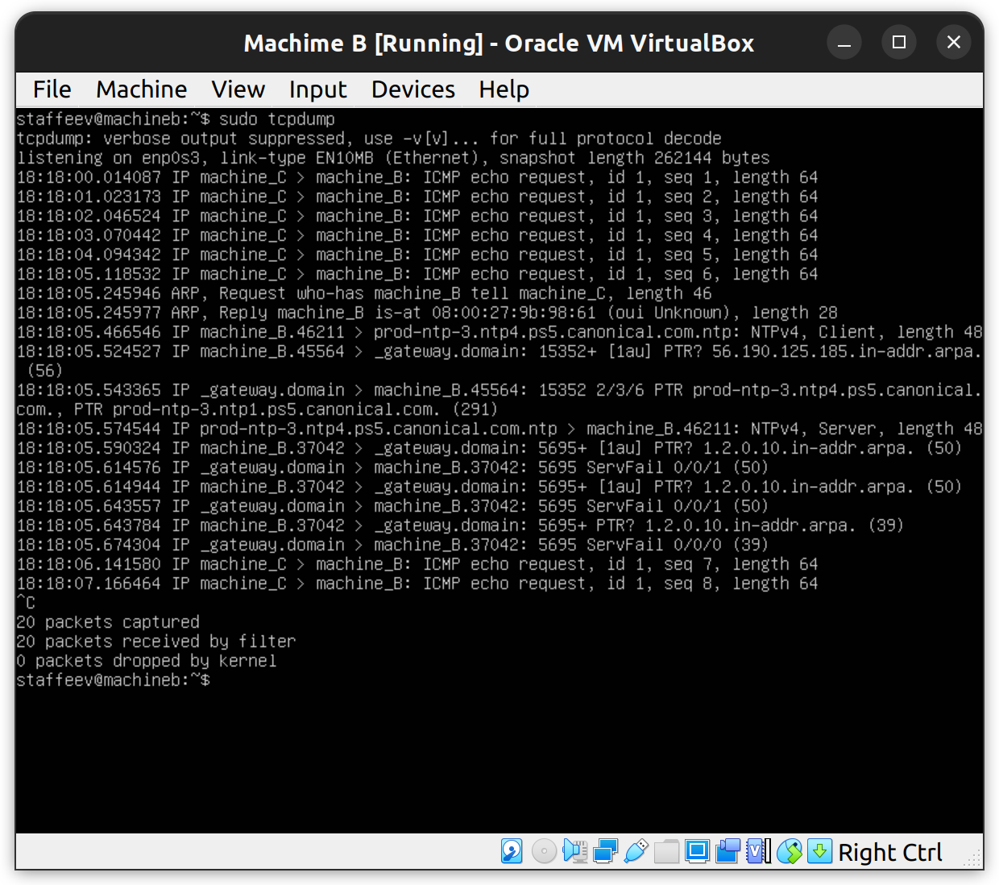
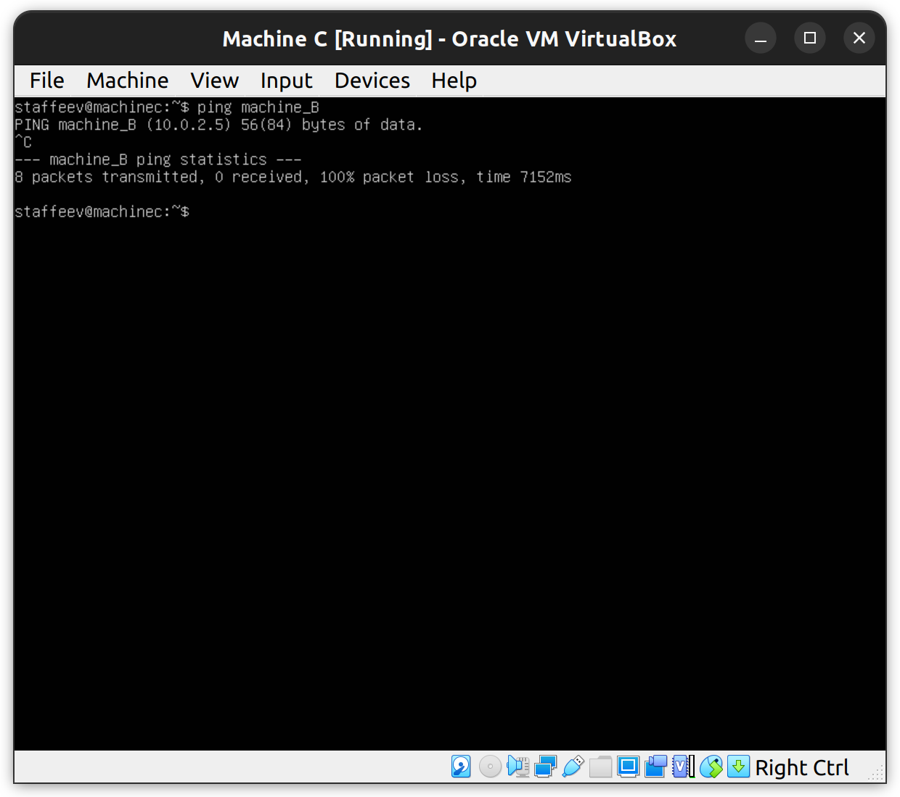
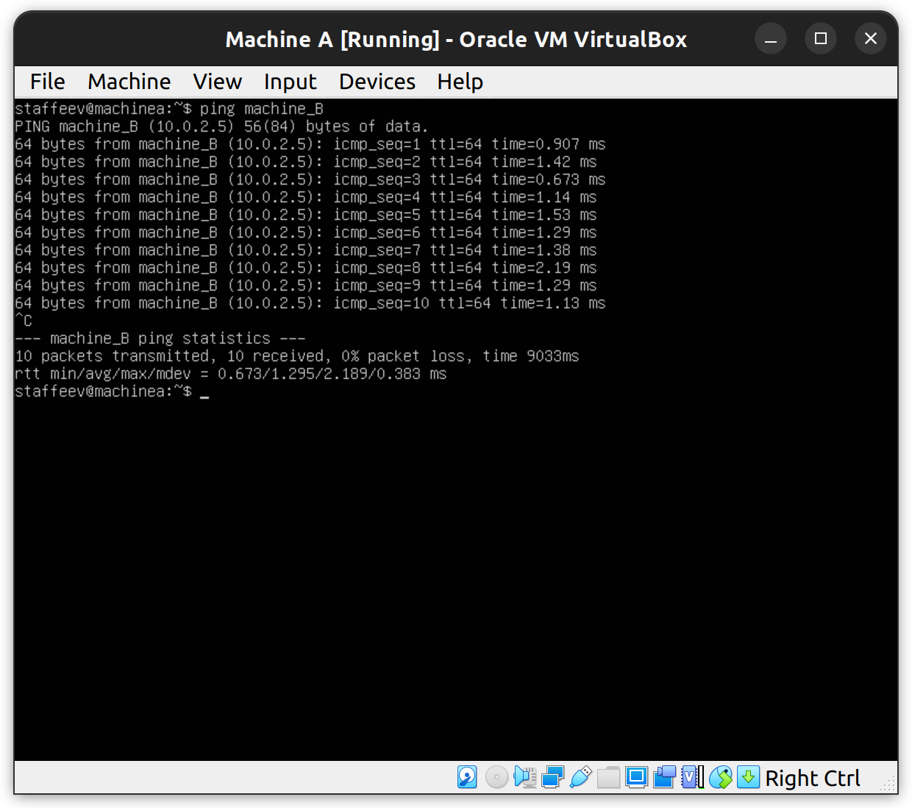
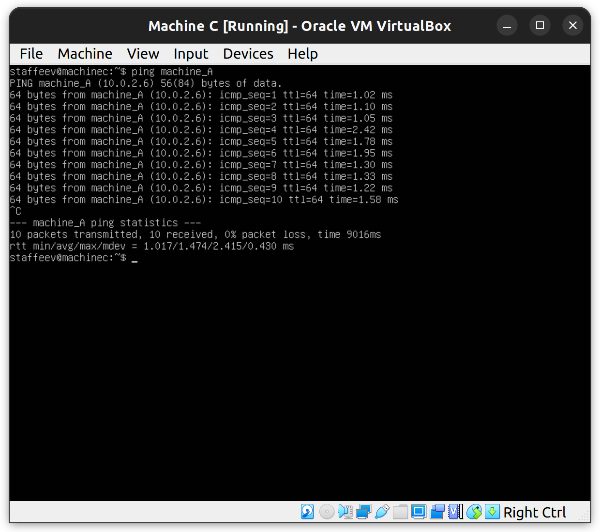

## Ответ по лабораторной работе №3
*Цель работы:* познакомиться с возможностями виртуализации с помощью утилиты VirtualBox

*Задачи:*

* Создать виртуальные машины A, B, C
* Обеспечить доступ машин в Интернет
* Установить сетевой доступ из машины A в машину B и из машины A в машину C
* Запретить сетевой доступ из машины D в машину C

### Установка VirtualBox и создание виртуальных машин
Так как я устанавливал VirtualBox на Ubuntu, я воспользовался двумя командами в терминале: `sudo apt-get install virtualbox`, которая непосредственно устанавливает программу, и `sudo apt-get install virtualbox-ext-pack`, которая устанавливает дополнительные компоненты программы (без них у меня не создавалась виртуальная машина из образа ОС)

Для создания виртуальных машин необходимо скачать образ ОС. Мной была выбрана серверная Ubuntu, поскольку она менее требовательна к ресурсам системы. Далеев идет процесс создания трех виртуальных машин через VirtualBox Manager, детально описывать который я не вижу смысла. Нужно выбрать пункт  **New** в меню и пройти обычный путь создания ВМ, выбрав образ скачанной только что серверной  Ubuntu. 

### Обеспечение доступа в Интернет
Доступ в Интернет при создании ВМ обеспечивается автоматически. Проверить его работоспособность можно, например, с помощью команды `ping my.itmo.ru`. ICMP пакеты отправляются, и на них приходят ответные пакеты, значит, доступ работает. На картинке можно увидеть результат вызова команды (показан только для одной ВМ, для остальных все работает так же)



### Установка сетевого доступа между машинами
На данный момент ВМ подключены к NAT и имеют доступ в Интернет, однако между собой они общаться не могут (у них одинаковые адреса). Одним из вариантов обеспечения доступа между машинами является создание NAT network в менеджере ВМ и подключение трех ВМ к этой сети.
Для создания NAT network надо выполнить следующие действия в менеджере ВМ: **Tools -> Preferences -> Network -> нажать на иконку с плюсом**. Чтобы подключить ВМ к созданной сети, необходимо выполнить следующую цепь действия **Settings -> Network -> Adapter 1 -> Attached to: NAT Network**
Теперь все три ВМ подключены к одной NAT Network, значит, они могут общаться между собой.

Проверить связь между машинами можно также с помощью команды `ping`, вызвав его с ip интересующей машины. Чтобы узнать ip, воспользуемся командой `ifconfig`. Интересующий нас ip находится в поле *inet* для интерфейса *enp0s3*. 



Для удобства для адресов машин создадим hostname'ы, чтобы можно было обращаться к ним не по адресу, а по этому имени. Для этого нужно в файл `/etc/hosts` каждой машины дописать строки типа `<имя машины> <адрес>`.



Теперь наконец проверим доступ между машинами. Из терминала машины A вызовем команду `ping machine_B`, а в терминале машины B вызовем команду `sudo tcpdump`, чтобы отслеживать все запросы к машине. Нетрудно заметить, что в терминале машины A выводится информация о выполненных ping-запросе (то есть машина A отправила ICMP пакет в машину B и в ответ получила пакет). А в терминале машины B видны как запросы из A в B (ICMP echo request), так и из B в A (ICMP echo reply). Для машин A и C все точно так же.
(картинки с доступом)

  

  

### Запрет доступа между машинами
На данный момент между машинами B и C существует сетевой доступ, что не соответствует заданию. Один из вариантов ограничения доступа - настроить подобие firewall'а для машины B с помощью пакета *iptables*. Нужно создать правило, которое будет блокировать поступающие пакеты из машины С при запросе с машины B. Соответствующая команда -  `sudo iptables -A OUTPUT -d machine_C -j REJECT`, ее нужно прописать в терминале машины B.
Теперь между машиными действительно нет доступа, точнее, у машины B нет доступа к C, но у С есть доступ к B. Проверим это, вызвав `ping machine_C` в термиале В и `sudo tcpdump` в терминале С.



  

Как можно увидеть, в терминале В пишется *Destination port unreachable*, а в терминасе С запросы не появляются, получается, доступ из В в С запрещен.

Проверим доступ из С в В таким же образом.

 

  

Видно, что запросы ICMP echo request из машины С поступают, то есть доступ не запрещен. Однако в терминале машины С никакой информации о принятых пакетах. Почему? Потому что машина В не может отправить echo reply, ведь мы ограничили ей доступ к машине С. Получается, что В принимает запросы от С, но не может ответить на них, поэтому для машины С пакеты теряются, но на самом деле на них не может прийти ответ из-за установленного нами ограничения доступа.

Единственное, что осталось сделать - настроить автоматическое примененение правила для iptables, поскольку по умолчанию новые правила сбрасываются при перезапуске ВМ. Сначала необходимо сохранить добавленное правило:
```
sudo su
sudo iptables-save > /etc/iptables_saved_rules
``` 
(Это команда требует выполнения с правами root, поэтому мы пользуемся первой командой)
Затем необходимо в файл `/etc/rc.local` (в этом файле указыываются все команды, которые должны выполниться после загрузки ОС) дописать строку `/sbin/iptables-restore < /etc/iptables_saved_rules`, которая восстанавливает правила для iptables из созданного ранее файла с правилами. Теперь при загрузке ВМ файервол будет начинать работу автоматически.


### Итог
На картинках можно увидеть работу трех машин. Видно, что доступ из А в В и из А в С (или же из С в А, как на картинке, что то же самое) есть, а доступ из В в С запрещен.

 

 




### Выводы
Цель работы достигнута, все поставленные задачи выполнены. В ходе работы были получены навыки виртуализации на Oracle VirtualBox Manager, которые будут полезны в профессиональной деятельности.