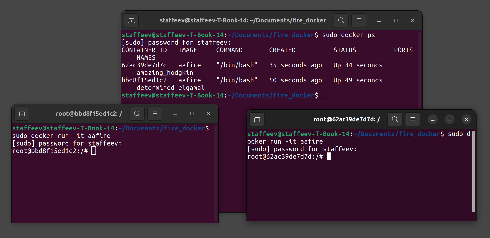
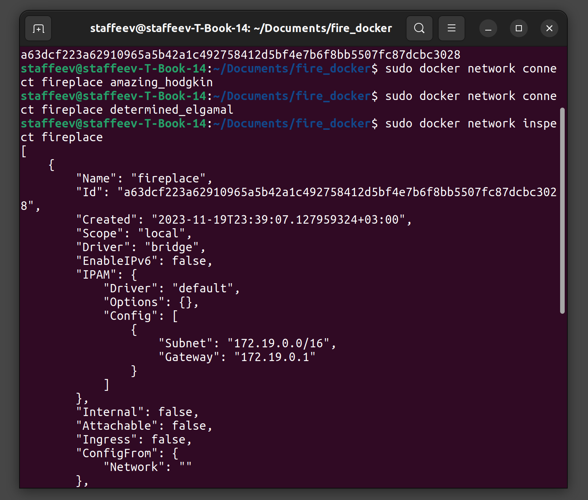
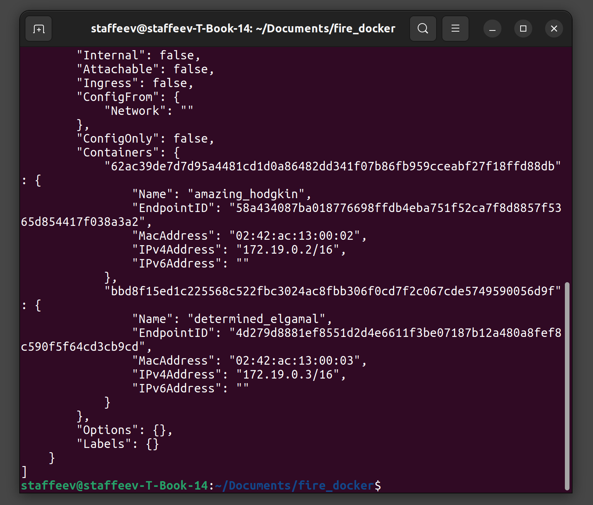
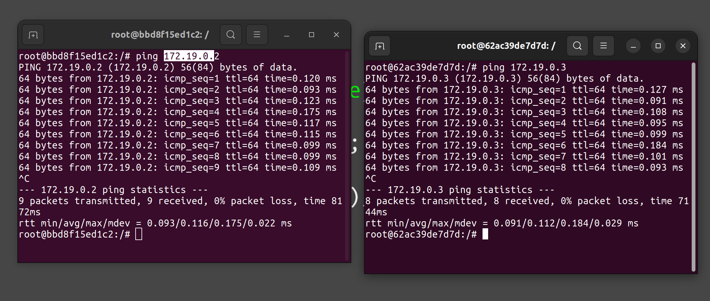

## Лабораторная работа №4

*Цель*: научиться создавать контейнеры для программ с помощью Docker

*Задачи*: 
- создать контейнер для программы aafire с добавленной туда утилитой ping;
- собрать образ и запустить два контейнера;
- настроить сеть между контейнерами и проверить ее работоспособность.

### Создание образа

Созданный **Dockerfile** для программы aafire выглядит следющим образом:
```
FROM ubuntu:latest
RUN apt-get update && apt-get install -y libaa-bin iputils-ping
```
Создание образа выполняется командой `sudo docker build -t aafire .`, запуск образа - командой `sudo docker run -it aafire`.

Результат запуска контейнеров можно увидеть на скриншоте ниже



### Настройка сети

Для создания сети и добавления в нее контейнеров был выполнен следующий набор команд:

```
sudo docker network create fireplace
sudo docker network connect fireplace amazing_hodgkin
sudo docker network connect fireplace determined_elgamal
sudo docker network inspect fireplace
```

Результат выполнения последней команды показан на сриншоте ниже




###  Проверка соединения

В том же выводе последней команды есть ip-адреса контейнеров, запомним их



Остается вызвать команду ping внутри каждого контейнера с ip-адресов другого контейнера. Результат выполнения на скриншоте ниже



*Вывод*: цель работы достигнута, все поставленные задачи выполнены
