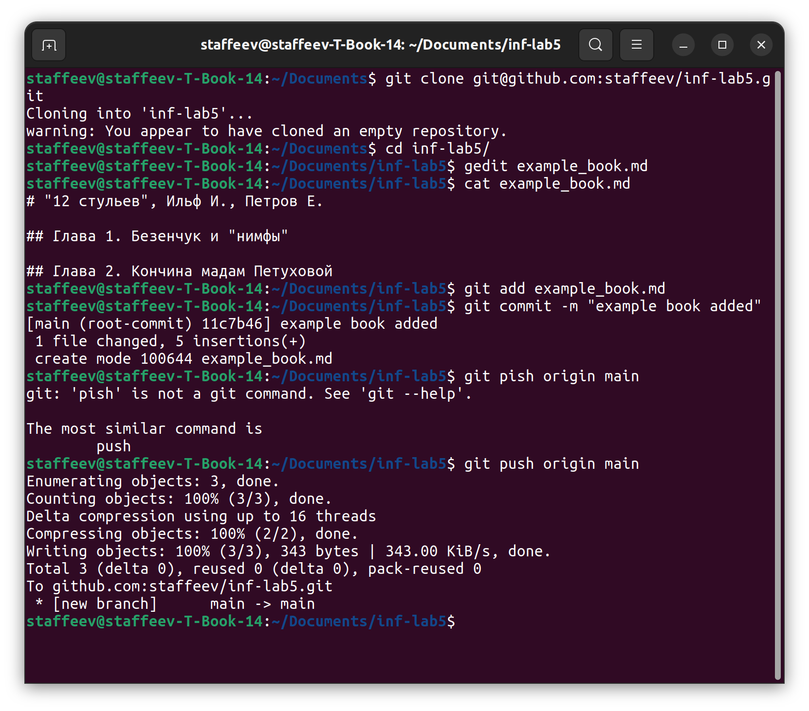
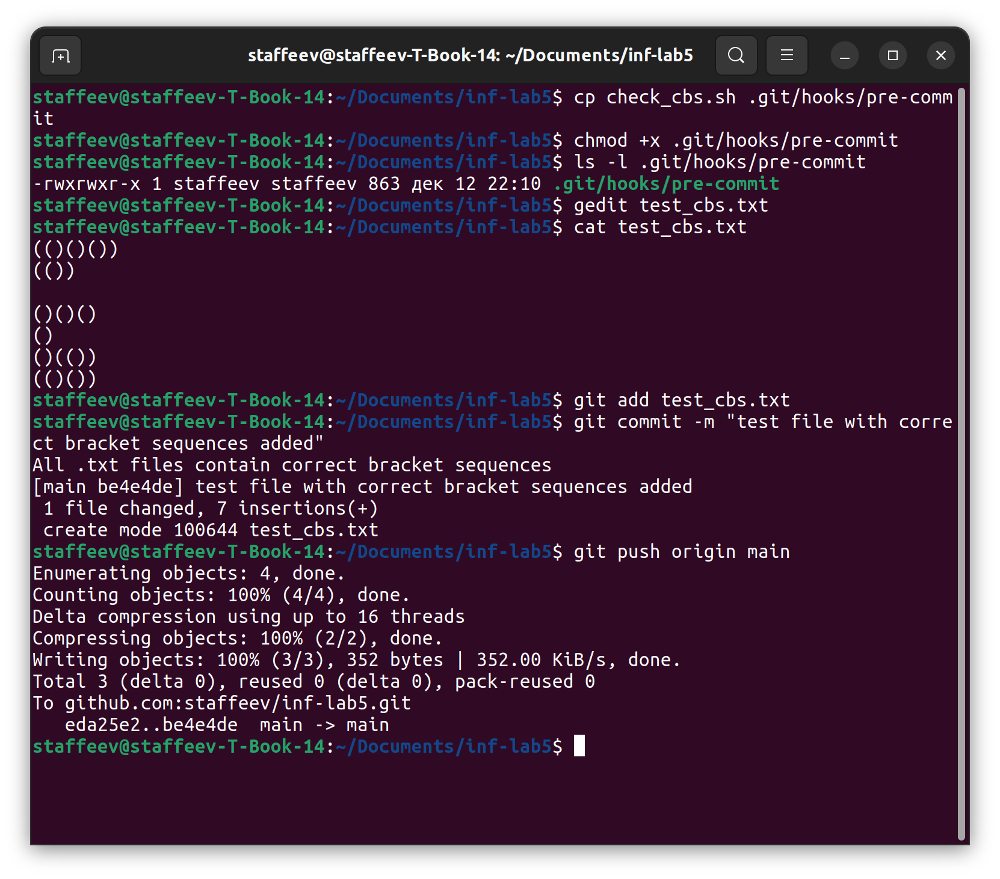
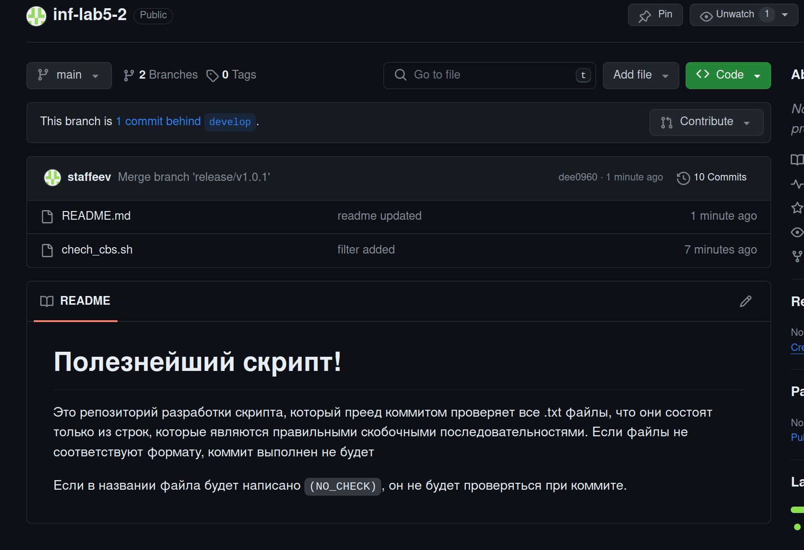

# Отчет по лабораторной работе №5

*Цель*: научиться более продвинутой работе с Git, используя ветки, разрешение конфликтов, автоматизацию проверки файлов при коммите и GitFlow 

## Введение 

Здесь и далее под добавлением файла в репозиторий будет подразумеваться последовательность комманд
```shell
git add <filename>
git commit -m "<commit message>"
```
а для переключения на другую ветку используется команда `git checkout <branch name>` с опциональным флагом `-b`, который нужуен для создания ветки, если на нее происходит переход, но она не была ранее создана

Под сохранением изменений подразумевается последовательное выполнение доабвления файла(-ов) и команды  `git push origin <branch name>`

Для работы был создан этот [репозиторий](https://github.com/staffeev/inf-lab5).

На следующем скриншоте приведены команды для клонирования созданного репозитория, добавления текстового файла со структурой книги, добавления этого файла с репозиторий и сохранения изменений в удаленный репозиторий.



На следующем скришоте приведены команды, которые создают ветку `feature/example_new_chapters`, вносят изменения в созданный ранее файл и сохраняют изменения.


На следующем скриншоте приведены команды для слияния ветки фичи в основную. Затем выводится содержимое текстового файла, чтобы убедиться, что изменения есть.


В удаленном репозитории файл в мейне дейстительно изменился с учетом изменений в ветке фичи


## Моделирование и разрешение конфликта

в мейне был создан новый файл со структурой книги (уже другой)


Затем в новой ветке `feature/book2_new_chapters` был изменен файл с книгой (добавлены новые главы). Изменения сохранены, но вливания в мейн пока нет


Следом я вернулся в основную ветку и произвел изменения на той в **3** строке файла, добавив описание и сохрани изменения.


Затем я снова вернулся в фича ветку и там изменил ту же **3** строчку файла, добавив отличающееся от основной ветки описание. 


Теперь при попытке влить изменения в мейн происходит конфликт. Это происхдит по той причине, что файл был изменен одновременно в одном месте, но в разных местах (в разных ветках). Система контроля версий попросту не может понять, где правильный вариант файла.


Чтобы исправить конфликт, необходимо изменить конфликтный файл.


Я скрестил описания из двух вариантов


После этого изменения уже можно сохранить в репозитории, проделав те же самые операции, что и раньше


Как можно заметить, изменения прошли успешно - смешанное описание добавилось


## Автоматизация проверки файлов при коммите

Для автоматизации проверки файлов при коммите я придумал следующую задачу. Пусть в .txt файлах мы храним в каждой строке правильную скобочную последовательность (условные тесты в задаче на CodeForces). При коммите надо проверить все текстовые файлы, действительно ли в них в каждой строке содержится ПСП. Если да, то коммит надо сделать, иначе написать, в каких строчках каких файлов проблемы, и коммит не делать.

Ниже сам скрипт (еще дублируется файлом в репозитории)

```shell
#!/bin/bash

function process_line(){
	local count=0
	local line="$1"
	for ((i=0; i<${#line}; i++))
	do
		local symb=${line:i:1}
		if [[ "$symb" == "(" ]]; then
			count=$((count+1))
		elif [[ "$symb" == ")" ]]; then
			count=$((count-1))
		else
			return 1
		fi
		if [[ "$count" < 0 ]]; then
			return 1
		fi
	done 
	if  [[ "$count" == 0 ]]; then
		return 0
	else
		return 1
	fi
}

function  process_file() {
	local counter=0
	while read -r line || [ -n "$line" ]
	do
		counter=$((counter+1))
		process_line $line
		local result=$?
		if [[ "$result" == 1 ]]; then
			echo "There is incorrect bracket sequence in line" "$counter" "in file" "$1"
			flag=1
		fi
	done < "$1"
}

flag=0
IFS=""
while read -r filename || [ -n "$filename" ]
do	
	process_file $filename
done < <(find . -type f -name '*.txt')

if [[ "$flag" > 0 ]]; then
	exit 1
else
	echo "All .txt files contain correct bracket sequences"
fi
```

После созданный скрипт `check_cbs.sh` я скопировал в файл `.git/hooks/pre-commit`, который будет выполняться преед каждым коммитом, и если его код завершения равен 0, то коммит будет совершен, в противном случае не будет.

Затем был создан файл `test_cbs.txt`, содержащий ПСП. как можно заметить, при сохранении файла  репозиторий скрипт работу выполнил - была выведена строка `All .txt files contain correct bracket sequence`.



После был создан файл, содержащий ПСП с ошибками. Видно, что скрипт сработал успешно, не дав коммиту выполниться. Строка `There is incorrect bracket sequence in line 1 in file ./test_cbs_2.txt` показывает, в каких строках каких файлов содержатся неправильные ПСП.

После изменения некорректных ПСП файл удалсь сохранить.


## Использование GitFlow

Для этого подзадания был создан новый [репозиторий](https://github.com/staffeev/inf-lab5-2).

Будем в этом репозитории "разрабатывать" созданный ранее скрипт для ПСП.

Сначала был инициализирован GitFlow и создана фича `check_txt_files`, отождествляющая создание скрипта из предыдущего задания.


После выполенния команды `finish` для этой ветки была создана ветка релиза, в которой я добавил README-файл с описанием скрипта.


После создания релиза остается только запушить изменения в ветки `develop` и `main`.


На скриншоте видно, что фича успешно создана и успешно прошла релиз.


Затем для ммоделирования конфликта были созданы таким же образом две фичи: `feature/filter_files_to_check` и `feature/filter_nnever_check`. 

В первой я изменил скрипт так, что файл будет проверяться только в том, случае, если у него в имени есть подстрока `(CHECK)`


Во второй скрипт изменен так, что при наличии подстроки `(NO_CHECK)` в имени файла он не будет проверяться. Изменения затронули те же строки, что и в первой фиче, чтобы озник конфликт.


Команды для создания фич приведены ниже:


Затем была завершена вторая фича (успешно), а после первая, во время завершения которой, очевидно, произошел конфликт, так как были одновременно изменены одни и те же строки скрипта.


Для разрешения конфликта нужно изменить файл скрипта. Я оставил условие с `(NO_CHECK)`


После изменения файла завершить первую фичу получилось. Следом был сделан новый релиз, и изменения в основной ветке и ветке разработки были запушены.


Изменения в репозитории появились.



Однако в скрипте спряталсь ошибка! Линукс не позволяет использовать скобки в имени файла поэтому то условие в скрипте не может никогда выполниться.


Срочно необходимо сделать хотфикс. Я решил просто убрать скобки из условия, чтоб файл можно было не проверять просто при наличии подстроки `NO_CHECK` (код не приведен, потому что он очевидный). 


После хотфикса код работает исправно. Я сделал два файла, в однном корректные ПСП, а в другом с ошибками, но второй имеет в названии нужный флаг для отказа от проверки (скрина нет, потому что все очевидно). Скрипт выполнился, второй файл не проверился багодаря добавленному флагу.

